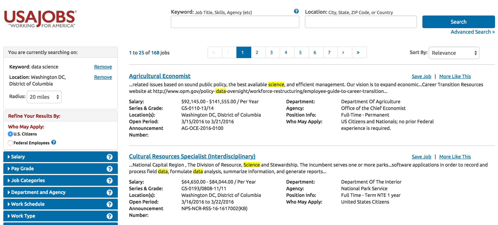

#  Project # 4: Build a Logistic Regression Model

## Overview

This week, we learned about web scraping and logistic regression. Now, we're going to put both of these skills to the test!

You're working as a data scientist for a government contracting firm that's rapidly expanding. Now that they have their most valuable employee (you!), they need to hire additional data scientists to win contracts. Your firm offers technology and scientific solutions and wants to be competitive in the hiring market; to understand competitive salaries for technologists and scientists, your principal thinks the best way to gauge salary amounts is to take a look at what the Federal Government themselves pays for these profressionals. 

The Federal Government regulary posts job openings for internal positions on its job site, usajobs.gov, as a means of seeking new talent. Often, the Federal Government and private firms, like your contracting firm, compete for potential employees from the same talent pool. Your job is to understand what factors most directly impact salaries for data scientists and related professionals so that your firm can be competitive in hiring the best talent!

In this project, we're going to be using a dataset that you will scrape from the web and clean. We're working with real world data, so prepare to get your data hands dirty!

Your job is to: 

- Collect data from [USAJobs](http://www.usajobs.gov) on Federal hiring, for your analysis
- Find out what factors most directly impact Federal employee salaries (Title, location, department, etc.)
- Author a report to your Principal detailing your analysis 

Here are some questions to keep in mind:

- What is the overall goal of this research project you have been assigned? 
- What insights can we derive from similar open positions? 
- What skills or factors most directly impact salaries? 

## Deliverables

- a Jupyter Notebook with your regression analysis for internal data scientists.
- A written report directed to your Principal detailing what factors most directly impact salaries for potential employees and how your firm might best use this knowledge to it's competitive advantage. You can find a sample report [here](https://www.dlsweb.rmit.edu.au/lsu/content/2_assessmenttasks/assess_tuts/reports_ll/report.pdf).

#### Bonus:

Generate your data not through Import.io, but manually using the Python package BeautifulSoup. Documentation for BeautifulSoup can be found [here](http://www.crummy.com/software/BeautifulSoup/).
 
## Submission

- iPython Notebook with problem statement, goals, and technical data
- Submit notebook via pull request on Github

## Starter code

- We will be utilizing a Jupyter Notebook for this project, where we will utilize Scikit-Learn, matplotlib, and numpy for our analysis

Open the starter code instructions in IPython notebook.

## Suggested Ways to Get Started

- Don’t hesitate to write throwaway code to solve short term problems
- Read the docs for whatever technologies you use.** Most of the time, there is a tutorial that you can follow, but not always, and learning to read documentation is crucial to your success as a developer
- Write pseudocode before you write actual code.** Thinking through the logic of something helps.
- Review your previous work and any prior intructor feedback.
- Look up sample executive summaries online.

## Resources

#### Dataset

We'll be utilizing a dataset derived from live web data: 

- [USAJobs](https://www.usajobs.com)

To access the data, first open import.io:

Then, navigate over to USAJobs and search for "data science," or another field of your choosing within the scope of technology. We're going to use the Washington, D.C. area for our example, so go ahead and use the zip code **20001** for downtown D.C. and search:

Go ahead and plug this into import.io and scape the data. 

There you are! We have our dataset.

#### Project Feedback + Evaluation

Base on the requirements you can earn a maximum of _____ points on this project. Your instructors will score each of your technical requirements using the scale below:

    Score | Expectations
    ----- | ------------
    **0** | _Incomplete._
    **1** | _Does not meet expectations._
    **2** | _Meets expectations, good job!_
    **3** | _Exceeds expectations, you wonderful creature, you!_

 This will serve as a helpful overall gauge of whether you met the project goals, but __the more important scores are the individual ones__ above, which can help you identify where to focus your efforts for the next project!
